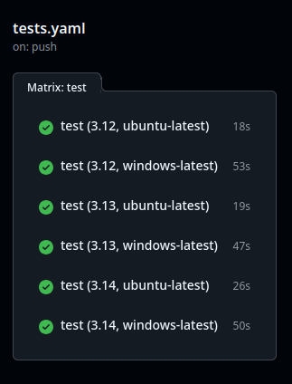
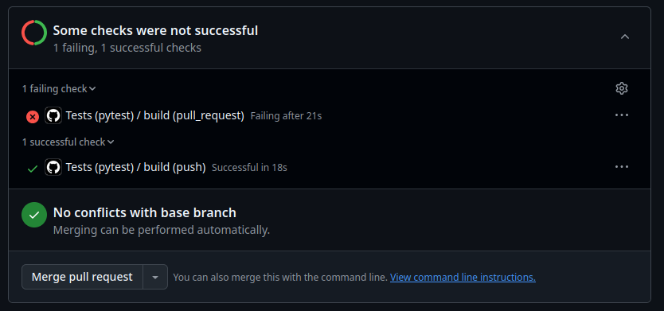

:::::::::::::::::::::::::::::::::::::: questions 

- How can I automate the testing of my code?
- What are GitHub Actions?

::::::::::::::::::::::::::::::::::::::::::::::::

::::::::::::::::::::::::::::::::::::: objectives

- Understand the concept of continuous integration
- Learn how to use GitHub Actions to automate the testing of your code

::::::::::::::::::::::::::::::::::::::::::::::::

## Continuous Integration

Continuous Integration (CI) is the practice of automating the merging of code
changes into a project. In the context of software testing, CI is the practice
of running tests on every code change to ensure that the code is working as
expected. GitHub provides a feature called GitHub Actions that allows you to
integrate this into your projects.

In this lesson we will go over the basics of how to set up a GitHub Action
to run tests on your code.

:::::: prereq

This lesson assumes a working knowledge of Git and GitHub. If you get stuck,
you may find it helpful to review the Research Coding Course's
[material on version control](https://researchcodingclub.github.io/course/#version-control-introduction-to-git-and-github)

:::::::::::::

## Setting up your project repository

- Create a new repository on GitHub for this lesson called
  "python-testing-course" (whatever you like really). We
  recommended making it public for now.
- Clone the repository into your local machine using `git clone
  <repository-url>` or via Github Desktop.
- Move over all your code from the previous lessons into this repository.
- Commit the changes using `git add .` and `git commit -m "Add all the project code"`
- Create a new file called `requirements.txt` in the root of your repository
  and add the following contents:

```
pytest
numpy
snaptol
```

This is just a list of all the packages that your project uses and will be
needed later. Recall that each of these are used in various lessons in this
course.

:::::: callout

Nowadays it is usually preferable to list dependencies in a file called
`pyproject.toml`, which also allows Python packages to be installed and
published. Look out for our upcoming course on reproducible environments to
learn more!

::::::::::::::

Now we have a repository with all our code in it online on GitHub.

## Creating a GitHub Action

GitHub Actions are defined in `yaml` files -- a structured text file which is
commonly used to pass settings to programs. They are stored in the
`.github/workflows` directory in your repository.

- Create a new directory in your repository called `.github`
- Inside the `.github` directory, create a new directory called `workflows`
- Inside the `workflows` directory, create a new file called `tests.yaml`

This `test.yaml` file is where you will tell GitHub how to run the tests for your code.

Let's add some instructions to the `tests.yaml` file:

```yaml
# This is just the name of the action, you can call it whatever you like.
name: Tests (pytest)

# This sets the events that trigger the action. In this case, we are telling
# GitHub to run the tests whenever a push is made to the repository.
# The trailing colon is intentional!
on:
  push:

# This is a list of jobs that the action will run. In this case, we have only
# one job called test.
jobs:

  # This is the name of the job 
  test:

    # This is the environment that the job will run on. In this case, we are
    # using the latest version of Ubuntu, however you can use other operating
    # systems like Windows or MacOS if you like!
    runs-on: ubuntu-latest

    # This is a list of steps that the job will run. Each step is a command
    # that will be executed on the environment.
    steps:

      # This command tells GitHub to use a pre-built action. In this case, we
      # are using the actions/checkout action to check out the repository. This
      # just means that GitHub will clone this repository to the current
      # working directory.
      - uses: actions/checkout@v6

      # This is the name of the step. This is just a label that will be
      # displayed in the GitHub UI.
      - name: Set up Python 3.12
        # This command tells GitHub to use a pre-built action. In this case, we
        # are using the actions/setup-python action to set up Python 3.12.
        uses: actions/setup-python@v6
        with:
            python-version: "3.12"

      # This step installs the dependencies for the project such as pytest,
      # numpy, pandas, etc using the requirements.txt file we created earlier.
      - name: Install dependencies
        run: |
          python -m pip install --upgrade pip
          pip install -r requirements.txt

      # This step runs the tests using the pytest command. 
      - name: Run tests
        run: |
          pytest
```

This is a simple GitHub Action that runs the tests for your code whenever code
is pushed to the repository, regardless of what was changed in the repository
or which branch you push too. We'll see later how to run tests only when
certain criteria are fulfilled.

## Upload the workflow to GitHub

Now that you have created the `tests.yaml` file, you need to upload it to GitHub.

- Commit the changes using `git add .` and `git commit -m "Add GitHub Action to run tests"`
- Push the changes to GitHub using `git push`

This should trigger a workflow on the repository. While it's running, you'll see an orange
circle next to your profile name at the top of the repo. When it's done, it'll change to
a green tick if it finished successfully, or a red cross if it didn't.

{alt="GitHub repository view with a green tick indicating a successful workflow run"}

You can view all previous workflow runs by clicking the 'Actions' button on the
top bar of your repository.

{alt="GitHub Actions Button"}

If you click on the orange circle/green tick/red cross, you can also view the
individual stages of the workflow and inspect the terminal output.

{alt="Detailed view of a GitHub workflow run"}


## Testing across multiple platforms

A very useful feature of GitHub Actions is the ability to test over a wider
range of platforms than just your own machine:

- Operating systems
- Python versions
- Compiler versions (for those writing C/C++/Fortran/etc)

We can achieve this by setting `jobs.<job_id>.strategy.matrix` in our workflow:

```yaml
jobs:
  test:
    strategy:
      matrix:
        python_version: ["3.12", "3.13", "3.14"]
        os: ["ubuntu-latest", "windows-latest"]
    runs-on: ${{ matrix.os }}
    steps:
      ...
```

Later in the file, the `setup-python` step should be changed to:

```yaml
      - name: Set up Python ${{ matrix.python_version }}
        uses: actions/setup-python@v6
        with:
            python-version: ${{ matrix.python_version }}
```

By default, all combinations in the matrix will be run in separate jobs. The
syntax `${{ matrix.x }}` inserts the text from the `x` list for the given matrix job.

::::::::::::::::::::::::::::::::::::: challenge 

## Upgrade the workflow to run across multiple platforms

- Make the changes above to your workflow file, being careful to get the indentation right!
- Commit the changes and push to GitHub.
- Check the latest jobs in the Actions panel.

:::::::::::::::::::::::: solution 

You should see that a total of 6 jobs have run, and hopefully all will have passed!

{alt="Completed matrix tests."}

:::::::::::::::::::::::::::::::::

::::::::::::::::::::::::::::::::::::::::::::::::


This ensures that code that runs on your machine should, in theory, run on many
other peoples' machines too. However, it's best to restrict the matrix to the
minimum number of necessary platforms to ensure you don't waste resources. You
can do so with a list of exclusions:

```yaml
    strategy:
      matrix:
        python_version: ["3.12", "3.13", "3.14"]
        os: ["ubuntu-latest", "windows-latest"]
        # Only run windows on latest Python version
        exclude:
          - os: "windows-latest"
            python_version: "3.12"
          - os: "windows-latest"
            python_version: "3.13"
````

## Running on other events

You may have wondered why there is a trailing colon when we specify `push:` at
the top of the file. The reason is that we can optionally set additional
conditions on when CI jobs will run. For example:

```yaml
on:
  push:
    # Only check when Python files are changed.
    # Don't need to check when the README is updated!
    paths:
      - '**.py'
      - 'pyproject.toml'
    # Only check when somebody raises a push to main.
    # (not recommended in general!)
    branches: [main]
```

Doing this can prevent pointless CI jobs from running and save resources.

You can also run on events other than a push. For example:

```yaml
on:
  push:
    paths:
      - '**.py'
      - 'pyproject.toml'
  # Run on code in pull requests.
  pull_request:
    paths:
      - '**.py'
      - 'pyproject.toml'
  # This allows you to launch the job manually
  workflow_dispatch:
```

There is an important subtlety to running on `pull_request` versus
`push`:

- `push` runs directly on the commits you push to GitHub.
- `pull_request` runs on the code that would result _after_ the pull request
  has been merged into its target branch.

In collaborative coding projects, it is entirely possible that `main` will have
diverged from your branch while you were working on it, and tests that pass on
your branch will fail after the merge. For this reason, it's recommended to
always include both `push` and `pull_request` in your testing workflows.

::::::::::::::::::::::::::::::::::::: challenge 

## Running on pull requests (advanced)

Can you engineer a situation where a CI job passes on `push` but
fails on `pull_request`?

- Write a new function, commit the changes, and push it to your `main`
  branch.
- Switch to a new branch `my_branch` with `git switch -c my_branch`,
  and write a test for that function.
- Check that the test passes, and commit it.
- Push `my_branch` to GitHub with `git push -u origin my_branch`,
  but don't raise a pull request yet.
- Return to your `main` branch, and modify the function being tested.
- Push the changes to `main`.
- Now raise a pull request from `my_branch` into `main`.

:::::::::::::::::::::::: solution 

The code on the new branch will be testing the old implementation,
and should pass. However, following the merge, the test would fail.
This results in the `push` test passing, and the `pull_request` test
failing.

{alt="Example of tests failing on pull requests."}

:::::::::::::::::::::::::::::::::

::::::::::::::::::::::::::::::::::::::::::::::::

## Keypoints

So now, when you or your team want to make a feature or just update the code, the workflow is as follows:

- Create a new branch for the feature
- Write the code for the feature
- Write tests for the feature
- Push the code to GitHub
- Create a Pull Request
- Wait for the tests to pass or fail
- If the tests pass, merge the code into the main branch or fix the code if the tests fail

This will greatly improve the quality of your code and make it easier to collaborate with others.

::::::::::::::::::::::::::::::::::::: keypoints 

- Continuous Integration (CI) is the practice of automating the merging of code changes into a project.
- GitHub Actions is a feature of GitHub that allows you to automate the testing of your code.
- GitHub Actions are defined in `yaml` files and are stored in the `.github/workflows` directory in your repository.
- You can use GitHub Actions to ensure your tests pass before merging new code into your `main` branch.

::::::::::::::::::::::::::::::::::::::::::::::::

